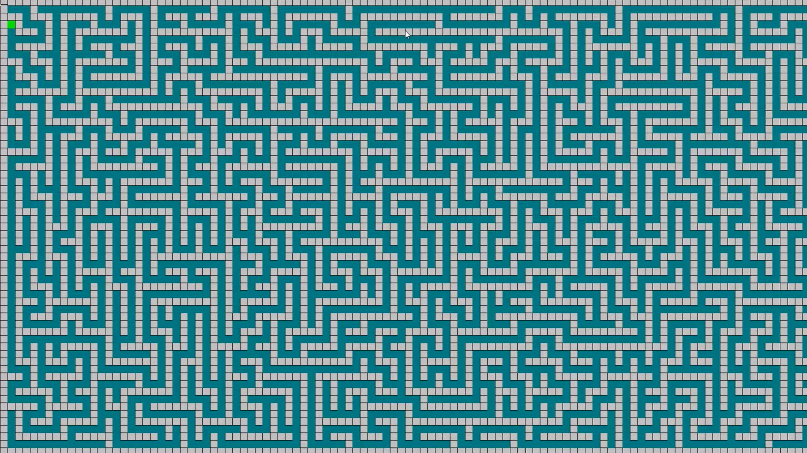

# maze_gen
 迷宮生成器+A星演算法

顯示的部分好像壞ㄌ

使用教學流程:
*   設定迷宮長寬(幾X幾)
*   生成迷宮(動畫)
*   左鍵放藍點與紅點(先藍再紅)
*   對藍或紅點雙擊左鍵可取消
*   放完後按enter顯示2點間的最短路徑
*   再按任意鍵清除版面與藍紅點
*   右鍵刪除牆壁或新增牆壁
*   生成迷宮後，會將迷宮的txt檔輸出(用01表示路或牆)

demo影片:
